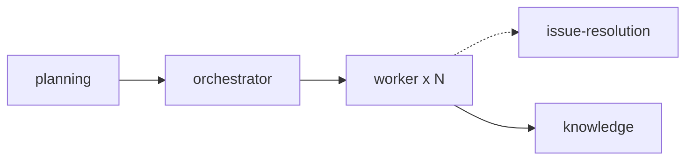

# Skills

## Multi-Agent Workflow



| Skill | Purpose |
|-------|---------|
| **planning** | Creates execution plans with beads, tracks, and dependencies |
| **orchestrator** | Spawns parallel worker agents and monitors progress |
| **worker** | Executes beads within assigned tracks using Agent Mail |
| **knowledge** | Extracts learnings from threads and updates documentation |
| **issue-resolution** | Handles bugs through triage, RCA, and verified fixes |
| **commit-messages** | Write clear commit messages following conventional format |
| **frontend-design** | Create distinctive, production-grade frontend interfaces |

### Typical Flow

1. `planning` → Tạo execution plan với beads và tracks
2. `orchestrator` → Spawn workers via `Task()`, mỗi worker load `worker` skill
3. `worker` → Execute beads, report progress via Agent Mail
4. `issue-resolution` → Dùng khi gặp bugs cần debug (optional)
5. `knowledge` → Extract learnings, update docs sau khi hoàn thành
6. `commit-messages` → Dùng khi commit changes

---

# TL;DR - 5 Rules for Agents

1. **Beads là source-of-truth** cho tasks - không tạo/quản lý task ở nơi khác
2. **Luôn bắt đầu bằng** `bd ready` hoặc `bv --robot-triage`
3. **KHÔNG chạy `bv` trực tiếp** - chỉ dùng `--robot-*` flags
4. **Work chưa xong** cho đến khi `git push` thành công
5. **Mỗi commit** nên include `bd-###` để traceability

---

# Git Commit Convention (Conventional Commits)

> 💡 Dùng `/skill commit-messages` để được hướng dẫn chi tiết.

Format:
```
<type>(<scope>): <subject>
```

**Types:**
| Type | Mô tả |
|------|-------|
| `feat` | Tính năng mới |
| `fix` | Sửa bug |
| `docs` | Thay đổi documentation |
| `style` | Format code (không ảnh hưởng logic) |
| `refactor` | Refactor code |
| `test` | Thêm/sửa test |
| `chore` | Build, config, dependencies |

**Quy tắc:**
- Subject: viết thường, không dấu chấm cuối, ≤50 ký tự, imperative mood ("add" không phải "added")
- Scope: optional, chỉ module/component liên quan (auth, api, ui...)
- Footer: reference issue (`Closes #123`, `BREAKING CHANGE:`)
- Include `bd-###` trong commit message khi làm việc với Beads issue

**Ví dụ:**
```bash
git commit -m "feat(auth): add Google OAuth login" -m "bd-42" -m "Closes #123"
git commit -m "fix(api): resolve null pointer in user service"
```

**Windows:** Dùng multiple `-m` flags cho multi-line commits.

---

# Beads / bd: Core Workflow

This project uses **bd** (beads) for issue tracking. Run `bd onboard` to get started.

## Commands

```bash
bd ready                              # Tìm việc sẵn sàng (không bị block)
bd list --status=open                 # Tất cả issues đang mở
bd show <id>                          # Chi tiết issue + dependencies
bd create --title="..." --type=task --priority=2 --body-file=<desc.md>
bd update <id> --status=in_progress   # Claim work
bd close <id> --reason="Completed"    # Hoàn thành
bd close <id1> <id2>                  # Đóng nhiều issues
bd dep add <issue> <depends-on>       # Thêm dependency
bd worktree create .worktrees/<name> --branch feature/<name>  # Isolate feature
bd sync                               # Commit và push .beads changes
```

## Workflow Pattern

1. **Start**: `bd ready` → chọn việc có priority cao nhất
2. **Claim**: `bd update <id> --status=in_progress`
3. **Work**: Implement task
4. **Complete**: `bd close <id>`
5. **Sync**: `bd sync` trước khi kết thúc session

## Key Concepts

- **Dependencies**: Issues có thể block nhau. `bd ready` chỉ hiện unblocked work
- **Priority**: P0=critical, P1=high, P2=medium, P3=low, P4=backlog (dùng số)
- **Types**: task, bug, feature, epic, question, docs
- **Worktrees**: Dùng `bd worktree` để isolate feature work, tránh merge conflicts

---

# Session Completion (Landing the Plane)

**Khi kết thúc session, PHẢI hoàn thành TẤT CẢ các bước:**

```bash
# 1. Check changes
git status

# 2. Stage & commit code
git add <files>
git commit -m "<type>(<scope>): <subject>" -m "bd-###"

# 3. Sync beads
bd sync

# 4. Handle conflicts nếu có
git pull --rebase

# 5. PUSH - BẮT BUỘC
git push
git status  # PHẢI hiện "up to date with origin"
```

**CRITICAL RULES:**
- Work CHƯA XONG cho đến khi `git push` thành công
- KHÔNG BAO GIỜ dừng trước khi push - work sẽ bị kẹt locally
- Nếu push fail → resolve conflicts → retry cho đến khi thành công
- Tạo issues mới cho remaining work trước khi kết thúc

---

# bv Quick Reference

⚠️ **CRITICAL: Chỉ dùng `--robot-*` flags. KHÔNG chạy `bv` trực tiếp - sẽ launch TUI và block session.**

## Essential Commands

```bash
bv --robot-triage    # MEGA-COMMAND: start here - trả về recommendations, quick wins, blockers
bv --robot-next      # Minimal: chỉ top pick + claim command
bv --robot-plan      # Parallel execution tracks
bv --robot-suggest   # Find missing dependencies
bv --robot-insights  # Detect cycles, bottlenecks
```

## Common Usage

```bash
# Tìm việc tiếp theo
bv --robot-triage | jq '.quick_ref'
bv --robot-triage | jq '.recommendations[0]'

# Lấy plan
bv --robot-plan | jq '.plan.tracks'
bv --robot-plan | jq '.plan.summary.highest_impact'

# Filter theo label
bv --robot-plan --label backend
bv --robot-triage --robot-triage-by-label
```

**Scope boundary:** bv = triage/planning. Beads (bd) = task status. Agent Mail = coordination.

---

# Agent Mail Integration

Khi tích hợp với MCP Agent Mail:

## Thread Types

| Thread | Purpose |
|--------|---------|
| `<epic-id>` | Cross-agent, orchestrator communication |
| `track:<AgentName>:<epic-id>` | Personal context persistence per worker |

## Mapping Cheat-sheet

| Beads | Agent Mail |
|-------|------------|
| Issue ID `bd-###` | `thread_id` |
| Issue title | Subject: `[bd-###] <title>` |
| Issue ID | File reservation `reason` |

## Worker Flow (per bead)

```
START: summarize_thread → fetch_inbox → file_reservation_paths → bd update
WORK:  gkg tools → edit files → get_diagnostics → check inbox
DONE:  verify → bd close → send_message (orchestrator) → send_message (self) → release
NEXT:  loop to START
```

## Typical Flow

1. **Pick work**: `bd ready --json` → chọn highest priority
2. **Reserve files**: `file_reservation_paths(..., reason="bd-123")`
3. **Announce**: `send_message(..., thread_id="bd-123", subject="[bd-123] Start: <title>")`
4. **Work**: Reply in-thread với progress
5. **Complete**: 
   - `bd close bd-123 --reason="Completed"`
   - `release_file_reservations(...)`
   - Final reply: `[bd-123] Completed`

## Pitfalls

- KHÔNG tạo/quản lý tasks trong Mail - Beads là single task queue
- LUÔN include `bd-###` trong `thread_id` để tránh ID drift

---

# Planning Skill Output Artifacts

| Artifact | Location | Purpose |
|----------|----------|---------|
| Discovery Report | `history/<feature>/discovery.md` | Codebase snapshot |
| Approach Document | `history/<feature>/approach.md` | Strategy + risks |
| Spike Code | `.spikes/<feature>/` | Reference implementations |
| Execution Plan | `history/<feature>/execution-plan.md` | Track assignments for orchestrator |

---

# Issue Resolution Pipeline

Dùng `/skill issue-resolution` khi debug bugs:

```
INPUT → Triage → Reproduction → Root Cause Analysis → Impact → Fix → Verify
             ◄──────────────►◄────────────────────►
                   (Iterative loops allowed)
```

| Phase | Purpose | Output |
|-------|---------|--------|
| Triage | Normalize input, classify severity | Issue Brief |
| Reproduction | Prove the bug, trace code path | Repro Report + Test |
| Root Cause Analysis | Find WHY, not just WHERE | RCA Report |
| Impact Assessment | Blast radius, regression risk | Impact Report |
| Fix Decomposition | Break into beads | `.beads/*.md` |
| Verification | Prove fix works, no regressions | Passing tests |

Save artifacts to `history/issues/<id>/` (brief.md, repro.md, rca.md, impact.md).

---

# Tool Preferences

| Task | Preferred Tool |
|------|----------------|
| Codebase structure | `mcp__gkg__repo_map` |
| Find definitions | `mcp__gkg__search_codebase_definitions` |
| Find usages | `mcp__gkg__get_references` |
| External patterns | `librarian` |
| Library docs | `mcp__exa__get_code_context_exa` |
| Gap analysis | `oracle` |
| Create beads | `bd create` |
| Validate graph | `bv --robot-*` |

<!-- bv-agent-instructions-v1 -->
<!-- end-bv-agent-instructions -->
